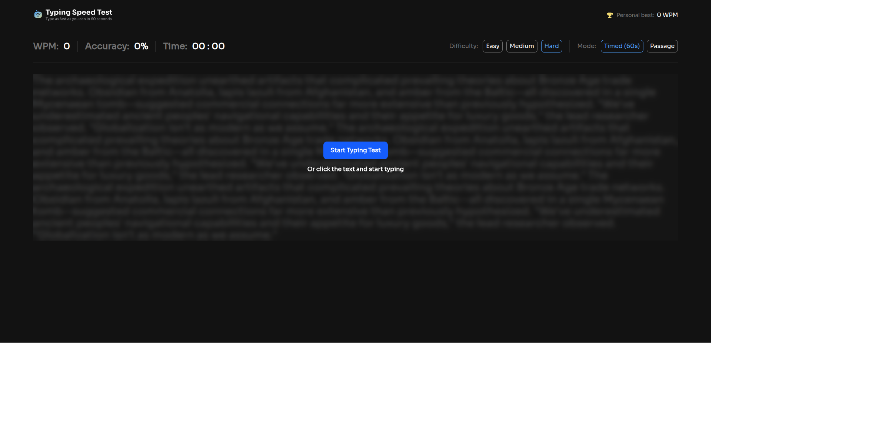

# Frontend Mentor - Typing Speed Test solution

This is a solution to the [Typing Speed Test challenge on Frontend Mentor](https://www.frontendmentor.io/challenges/typing-speed-test). Frontend Mentor challenges help you improve your coding skills by building realistic projects.

## Table of contents

- [Overview](#overview)
  - [The challenge](#the-challenge)
  - [Screenshot](#screenshot)
  - [Links](#links)
- [My process](#my-process)
  - [Built with](#built-with)
  - [What I learned](#what-i-learned)
  - [Continued development](#continued-development)
- [Author](#author)
- [Acknowledgments](#acknowledgments)

## Overview

### The challenge

Users should be able to:

#### Test Controls
- Start a test by clicking the start button or by clicking the passage and typing
- Select a difficulty level (Easy, Medium, Hard) for passages of varying complexity
- Switch between "Timed (60s)" mode and "Passage" mode (timer counts up, no limit)
- Restart at any time to get a new random passage from the selected difficulty

#### Typing Experience
- See real-time WPM, accuracy, and time stats while typing
- See visual feedback showing correct characters (green), errors (red/underlined), and cursor position
- Correct mistakes with backspace (original errors still count against accuracy)

#### Results & Progress
- View results showing WPM, accuracy, and characters (correct/incorrect) after completing a test
- See a "Baseline Established!" message on their first test, setting their personal best
- See a "High Score Smashed!" celebration with confetti when beating their personal best
- Have their personal best persist across sessions via localStorage

#### UI & Responsiveness
- View the optimal layout depending on their device's screen size
- See hover and focus states for all interactive elements

### Screenshot



### Links

- Solution URL: [GitHub Repository](https://github.com/afuhflynn/typing-speed-test.git)
- Live Site URL: [Live site on vercel](https://typing-speed-test-nine-teal.vercel.app)

## My process

### Built with

- Semantic HTML5 markup
- CSS custom properties
- Flexbox
- CSS Grid
- Mobile-first workflow
- [React](https://reactjs.org/) - JS library
- [Tailwindcss](https://tailwindcss.com/docs) - Css Framework

### What I learned

This project has been a learning journey involving how to calculate WPM and accuracy, display user input character by character for easy control, and simulate a fake typing caret.

How are implemented wpm, accuracy calculation:

```tsx
useEffect(() => {
    // Update accuracy-related stats
    const { errorCount, accuracy, correctChars } = calculateAccuracy();

    setAccuracyValue(accuracy);
    setErrorsValue(errorCount);
    setCharsValue(correctChars);

    // Calculate WPM
    if (startTimeRef.current > 0 && input.length > 0) {
      const currentTime = Date.now();
      const timeTakenInMinutes =
        (currentTime - startTimeRef.current) / 60000;

      const wordCount = input
        .trim()
        .split(/\s+/)
        .filter((word) => word.length > 0).length;

      const wpm =
        timeTakenInMinutes > 0
          ? Math.round(wordCount / timeTakenInMinutes)
          : 0;

      setWPMValue(wpm);
    }
  }, [input, text, calculateAccuracy, setAccuracyValue, setErrorsValue, setCharsValue, setWPMValue]);
```

Displaying user input character by character:

```tsx
const RenderChars = ({ input, text }: { input: string; text: string }) => {
  const caretIndex = input.length;

  return (
    <>
      {text.split("").map((char, i) => {
        let className = "text-neutral-500 relative";

        if (input[i]) {
          if (input[i] !== char) {
            className = "text-red-500 underline";
          } else {
            className = "text-green-500";
          }
        }

        const showCaret = i === caretIndex && !input[i];

        return (
          <span
            key={i}
            className={`${className} ${showCaret ? "caret-highlight" : ""}`}
          >
            {input[i] && input[i] !== char ? input[i] : char}
          </span>
        );
      })}
    </>
  );
};
```

Fake caret illusion:

```css
.caret-highlight::before {
  content: "";
  position: absolute;
  left: 0;
  top: 0;
  align-self: center;
  width: 2px;
  height: 90%;
  background: var(--color-neutral-500);
  animation: blink 1s steps(1) infinite;
}

@keyframes blink {
  50% {
    opacity: 0;
  }
}
```

### Continued development

Even though the app works as expected, the only issue now is that the transparent input element used in the typing canvas sometimes overflows and breaks the UI. So in future updates, I plan to fix this bug and possibly add pause/resume functionality to the typing app.

## Author

- Website - [Afuh Flynn Tembeng](https://github.com/afuhflynn)
- Frontend Mentor - [@afuhflynn](https://www.frontendmentor.io/profile/afuhflynn)
- Twitter - [@afuhflynn](https://www.twitter.com/afuhflynn)

## Acknowledgments

Given that it's been 3 years since I joined Frontend Mentor and looking at my progress all this time, I just want to take this time to give Frontend Mentor huge thanks for their challenges. It has really shaped my learning style.
[Frontend Mentor](https://www.frontendmentor.io)
